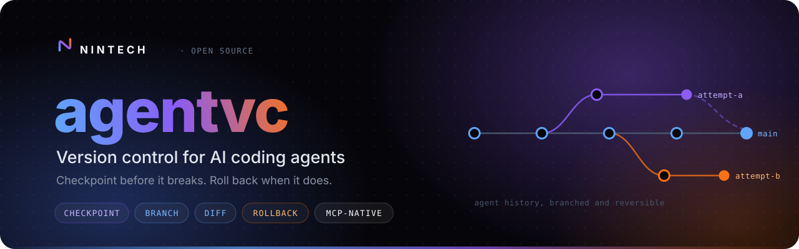
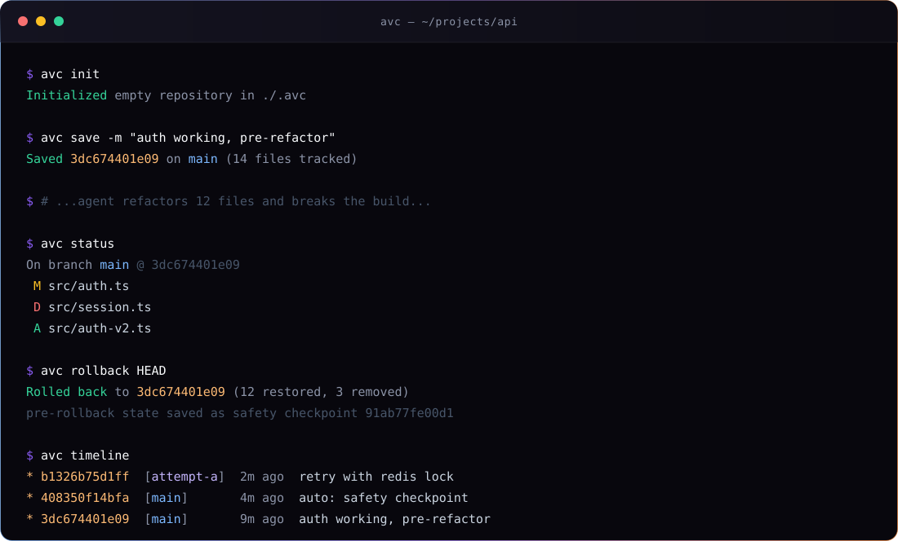
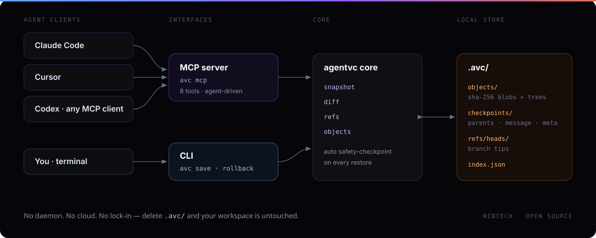

<div align="center">

<a href="https://nintech.io"></a>

<p>
  <a href="https://github.com/nintechio/agentvc/actions/workflows/ci.yml"></a>
  <a href="https://www.npmjs.com/package/agentvc"></a>
  <a href="https://modelcontextprotocol.io"></a>
  <a href="#requirements">= 20"></a>
  <a href="LICENSE"></a>
  <a href="https://nintech.io"></a>
</p>

<p>
  <b><a href="#quickstart">Quickstart</a></b> ·
  <b><a href="#give-your-agent-a-time-machine">MCP setup</a></b> ·
  <b><a href="#cli-reference">CLI</a></b> ·
  <b><a href="#use-it-as-a-library">Library</a></b> ·
  <b><a href="#how-it-works">Architecture</a></b> ·
  <b><a href="#roadmap">Roadmap</a></b>
</p>

<p><i>Your agent just deleted the wrong files. Again.<br>Roll the whole workspace back to a known-good second — and keep the work it did after it.</i></p>

</div>

---

## Why agentvc

Git was built for humans committing at human pace. AI agents mutate your workspace at machine pace: dozens of files per minute, wrong turns, half-finished refactors, deletions you never asked for. By the time you notice, `git stash` isn't going to save you.

**agentvc gives every agent session a time machine.** It snapshots the entire workspace in milliseconds, forks parallel attempts onto branches, and restores any previous state instantly — with **zero data loss by design**.

<div align="center">
  
</div>

## Features

|  | |
|---|---|
| **⏱ Instant checkpoints** | Snapshot every file with one command or one tool call. Content-addressed, deduplicated, milliseconds. |
| **↩ Lossless rollback** | Every restore auto-saves your current state first. Rolling back is itself reversible. |
| **⑃ Parallel attempts** | Branch the session, try approach B, compare, keep the winner. |
| **🤖 MCP-native** | 8 tools so Claude Code, Cursor, and Codex checkpoint and recover *themselves*. |
| **🔍 Real diffs** | See exactly what the agent touched between any two points in time — down to the line with `avc diff -p`. |
| **🔒 Local & private** | Everything lives in `.avc/`. No daemon, no cloud, no telemetry. |

## Why not just git?

|  | git | agentvc |
|---|---|---|
| Designed for | human commits | machine-speed agent steps |
| Staging dance | `add` / `commit` required | one command captures everything |
| Rollback safety | `checkout` can destroy uncommitted work | auto safety-checkpoint before every restore |
| "Try another approach" | heavyweight branching, easy to tangle | one tool call — agents do it themselves |
| Agent interface | none | first-class MCP server + TypeScript API |
| Per-step metadata | manual notes | structured JSON (`task`, `attempt`, model, tokens) |

agentvc doesn't replace git for shipping code. It sits **underneath** the agent loop: cheap, disposable, rewindable history that never pollutes your `git log`.

## Requirements

Node.js **20 or newer**. No other runtime dependencies.

## Install

```bash
npm install -g agentvc
```

Or run it without installing:

```bash
npx agentvc init
```

## Quickstart

```bash
mkdir demo && cd demo
avc init                              # initialise .avc/

echo "v1" > app.txt
avc save -m "known good state"        # checkpoint everything

echo "v2" > app.txt                   # ...agent goes wrong...
avc status                            # see what changed
avc diff -p                           # see exactly which lines changed
avc rollback HEAD                     # instant undo — nothing lost

avc branch plan-b && avc switch plan-b   # fork a parallel attempt
avc save -m "trying redis instead"
avc timeline                          # every attempt, side by side
```

## Give your agent a time machine

Register the bundled MCP server once and your agent can checkpoint and recover on its own.

**Claude Code**

```bash
claude mcp add agentvc -- avc mcp
```

**Cursor · Codex · any MCP client** — add to `.mcp.json` (or see [`examples/mcp-config.json`](examples/mcp-config.json)):

```json
{
  "mcpServers": {
    "agentvc": { "command": "avc", "args": ["mcp"] }
  }
}
```

Set `AVC_ROOT=/path/to/project` if the server shouldn't use its working directory.

### Teach it when to checkpoint

Drop this into your `AGENTS.md` / `CLAUDE.md` — it's the difference between a nice tool and a genuine safety net:

```markdown
## Session checkpoints (agentvc)

- Before any risky operation (refactors, deletions, dependency upgrades,
  schema changes), call `avc_save` with a short message.
- After reaching a working state, call `avc_save` again.
- If an approach fails twice, call `avc_rollback` to the last good checkpoint
  and try a different plan — optionally on a new branch via `avc_branch`.
- Never leave more than ~15 minutes of work uncheckpointed.
```

### MCP tools

| Tool | What the agent uses it for |
|---|---|
| `avc_save` | Snapshot the workspace before risky work or after success |
| `avc_status` | Check what's changed since the last checkpoint |
| `avc_log` | Review recent checkpoints on the current branch |
| `avc_branch` | Fork a parallel attempt without losing the current one |
| `avc_switch` | Move between attempts (auto-saves unsaved work first) |
| `avc_rollback` | Restore all files to a known-good checkpoint |
| `avc_diff` | Compare any two points in time, optionally with line-level patches (`patch: true`) |
| `avc_timeline` | See every attempt across all branches |

## CLI reference

| Command | Description |
|---|---|
| `avc init` | Initialise a repository in the current directory |
| `avc save [-m msg] [--meta json]` | Checkpoint the whole workspace |
| `avc status` | Show unsaved changes since the last checkpoint |
| `avc log [-n N]` | List checkpoints on the current branch |
| `avc branch [name] [start]` | Create or list branches |
| `avc switch <branch>` | Switch branches, restoring files |
| `avc rollback [ref]` | Restore files to a checkpoint (default `HEAD`) |
| `avc diff [from] [to]` | Compare refs, or a ref against the working tree |
| `avc diff -p [-U n] [from] [to]` | Same, as a unified diff with `n` lines of context (default 3) |
| `avc timeline` | Every checkpoint across every branch |
| `avc mcp` | Start the MCP stdio server |

Refs accept `HEAD`, a branch name, a full checkpoint id, or any unique id prefix.

`avc diff -p` prints standard unified diffs (`--- a/path`, `+++ b/path`, `@@` hunks), so the
output pipes straight into `patch -p1` or `git apply`. Binary files are reported as
`Binary files … differ`; files over 2 MB / 50,000 lines are listed without contents, and
rewrites too large for an exact line diff are shown as a whole-file replacement.

## Use it as a library

```ts
import { AgentVCS, formatPatch } from "agentvc";

const avc = new AgentVCS(projectRoot);
await avc.ensureInit();

const cp = await avc.save({
  message: "before db migration",
  meta: { task: "upgrade-postgres", attempt: 2 },
});

const { clean, modified } = await avc.status();
if (!clean) console.log("agent touched:", modified);

await avc.branch("plan-b");
await avc.checkout("plan-b");

await avc.rollback(cp.id);   // instant, lossless

for (const p of await avc.diffPatch(cp.id, "work")) {
  console.log(formatPatch(p));   // unified diff per file, with hunks available on p.hunks
}
```

Fully typed. `AgentVCS`, `diffTrees`, `computePatch`, `formatPatch`, and all result types are exported.

## How it works

<div align="center">
  
</div>

Content-addressed storage, git's good idea without git's ceremony:

```
.avc/
├── objects/ab/c3ef…      blobs + trees, deduplicated by SHA-256
├── checkpoints/          parents, tree, message, structured meta
├── refs/heads/main       branch tips
└── index.json            id → summary, for fast prefix lookups
```

- Identical file content is stored **once**, across every checkpoint and branch.
- Unchanged files are never rewritten on restore.
- Your existing `.gitignore` is respected; `.git/` and `node_modules/` are skipped.
- Delete `.avc/` and your workspace is untouched.

> [!IMPORTANT]
> **The safety guarantee.** Every `rollback` and `switch` snapshots your unsaved changes into an automatic *safety checkpoint* before touching a single file. Rolling back is reversible. There is no code path in agentvc that can lose your work.

## Roadmap

- [x] Line-level diffs in the terminal (`avc diff -p`)
- [ ] Branch merging (fast-forward today, 3-way next)
- [ ] Auto-save hooks: on file watcher, or after each agent turn
- [ ] Multi-agent coordination — two agents, one repo, separate branches
- [ ] Named milestones and session tags
- [ ] Python SDK with MCP parity
- [ ] Optional encrypted remote backup of the checkpoint store

Ideas and PRs welcome — see [CONTRIBUTING.md](CONTRIBUTING.md).

## Contributing

```bash
git clone https://github.com/nintechio/agentvc.git
cd agentvc && npm install
npm run typecheck && npm test && npm run build
```

Bug reports, feature requests, and pull requests are all welcome. Please read [CONTRIBUTING.md](CONTRIBUTING.md) and our [Code of Conduct](CODE_OF_CONDUCT.md). Security issues: see [SECURITY.md](SECURITY.md).

## License

[MIT](LICENSE) © [Nintech Ltd](https://nintech.io)

<div align="center">
<br>
<a href="https://nintech.io"></a>

**Built and maintained by [Nintech](https://nintech.io)**

*The engineers who build it also run it.*

Applied AI · resilient software engineering · managed hosting — UK & EU

<a href="https://nintech.io">nintech.io</a> ·
<a href="https://github.com/nintechio">GitHub</a> ·
<a href="https://x.com/nintechio">X</a> ·
<a href="https://www.youtube.com/@NinTechio">YouTube</a> ·
<a href="mailto:admin@nintech.io">admin@nintech.io</a>

</div>
